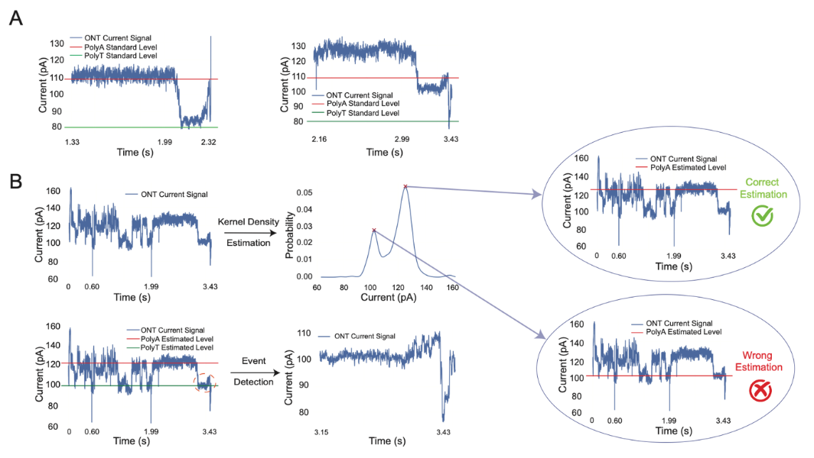
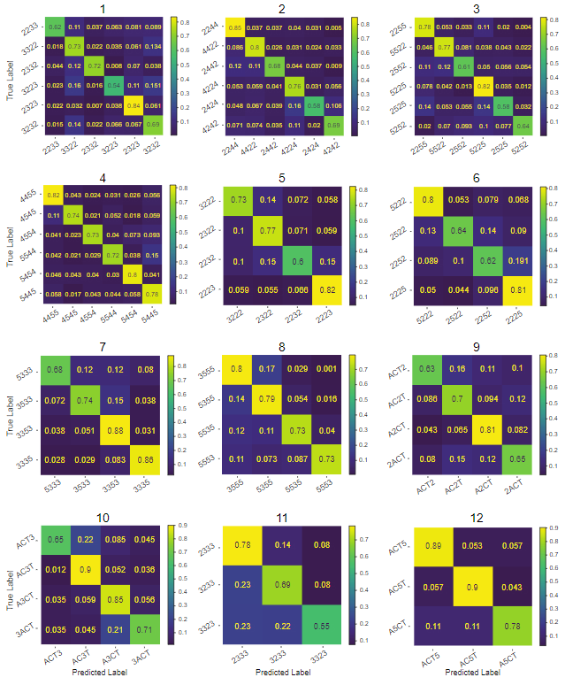

# Modified Bases Time Series Analysis
Official implementation of our paper "Expanding the Molecular Alphabet of DNA-Based Data Storage Systems with Nanopore Readouts".

Programming language: Python 3.7. Tested on operating systems: Windows 10, CentOS 7.7.1908.

Our method can be divided into two components: extracting signals of interest from raw fast5 files, and perform neural network classification on time series.

# Signal Extraction

The ONT (Oxford   Nanopore Technologies) raw fast5 files for all 77 tetramers are stored in [link]. We also store the final results after signal extraction step as `npy` files in [link].

The overall pipeline of this component is shown in the following figure. Please refer to **Figure S6** for more details.



To use the code, you need to first download the fast5 files into some directory and set the following data path accordingly.
```
python signal_extraction.py --data_path="raw_fast5" --out_dir="processed_files/extracted_signals"

python build_dataset.py --data_path="processed_files/extracted_signals" --pool_path="raw_fast5" 
                        --out_path="processed_files/dataset" --std_thres_ub=10.0
```

# Classification

With the built dataset, we are ready to perform classification with deep learning to achieve high classification accuracy.

### Classification over 66 patterns
```
python main_allclass_convplus.py --data_path="processed_files/dataset/"
                                 --lr=1e-3 --test_ratio=0.4 --batch_size=256 
                                 --max_epoch=200 --early_stop=25
                                 --chkpt="./chkpt/convplus/allclass_1e-3" 
                                 --max_sample=3500 --num_trails=1
```
**Confusion Matrix**


### Classification over permutation groups
```
python main_usecase_resnet1d.py --data_path="processed_files/dataset/"
                                --lr=1e-3 --test_ratio=0.4 --batch_size=64 
                                --max_epoch=400 --early_stop=50
                                --chkpt="./chkpt/resnet1d/U2_1e-3" 
                                --max_sample=5000 --num_trails=1
                                --usecase_short="U2" --model_param="[64,4,1,2]"
```
**Confusion Matrix**


